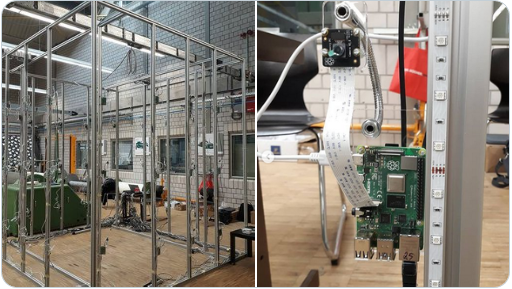

# 3DScanner

This project develops software for a person-sized, full body DIY Raspberry Pi based 3D scanner. The scanner stands at the [Textile Faculty of the Reutlingen University](https://www.td.reutlingen-university.de/en/startseite-englisch/). There, [Katerina Rose](https://www.td.reutlingen-university.de/fakultaet/ansprechpartner/lehre/#Katerina-Rose) researches novel approaches for digitization in the textil industry including textile technology and sewing pattern using CAD. The scanner is an enabling technology and an instrument a for her research. The picture below shows the current 3DScanner installation.



I support Katerina on the embedded software part for the scanner. This software controls the distributed camera system.

Investigators:

* [Katerina Rose](https://www.td.reutlingen-university.de/fakultaet/ansprechpartner/lehre/#Katerina-Rose)
* [Christian Decker](cdeck3r.com)

Ressources:

* [Trello board](https://trello.com/b/CqnWyFS4) to organize dev tasks

## Project Information

The project builds on the instructions from a [previous project](https://www.instructables.com/Multiple-Raspberry-PI-3D-Scanner/). There are several similar DIY projects of this type available on the Internet. Commercial products exist as well. 

The DIY project uses COTS available Raspberry Pis embedded computers to implement a distributed camera system. The available documentation is limited and the setup as well as the software operation of the camera hardware require substantial software skills.

However, researchers in this project are not software experts. The project goals are therefore

* enable non-software experts to reproduce the software setup of the scanner 
* transparentizing the scanner's software operation state for a successful application use

As an example of the goal implementation have look at the [flow chart to setup Raspberry Pi](https://github.com/cdeck3r/3DScanner/blob/master/docs/raspi_setup_process.md). Note the user's low effort as shown by the minimum interaction with the Raspberry Pi for the setup of the scanner software. 

## Technical Approach

From a computer science perspective the project proposes a couple of distributed system challenges. Since all software runs distributed on approx. 50 Raspberry Pi computers, a primary activity focuses on infrastructure support. Each software change applies to 50 Raspberry Pis. Automation of deployment is crucial. Some fundamental functions to support are 

* Automate deployment of software directly from github
* Secure access to Raspberry Pis
* Distributed management and control via web browser 
* Infrastructure unit testing
* Debugging and maintenance support

In all cases, we want to keep the end-user in mind and at the center of our development efforts.

During system operation the camera Raspberry Pis connect to a central node via MQTT publish/subscribe message queues. The central node collects all images and logging information. The user accesses the images files and reviews the status information on a dashboard in a web browser. The following UML diagram depicts the system design. 


We utilize the MQTT Homie convention which defines a standardized way of how IoT devices and services announce themselves and their data on the MQTT broker. The camnodes and centralnode implement the Homie convention to publishe data and provides interaction possibilities.

 

## Documentation

Please see [`docs`](docs) folder for full documentation 

## Dev System

We setup a docker image to support the development on a desktop computer. It helps us to reproduce script operations on the Raspberry Pi. The dev system bases on the Debian Buster distro. The motivation is that [Raspberry Pi OS](https://en.wikipedia.org/wiki/Raspberry_Pi_OS) bases on the same one. Currently, the version of the dev system is:

```bash
$ uname -a
Linux ec72378ae28c 4.19.76-linuxkit #1 SMP Tue May 26 11:42:35 UTC 2020 x86_64 GNU/Linux
```

**Setup:** Start in project's root dir and create a `.env` file with the content shown below.
```
# .env file

# In the container, this is the directory where the code is found
# Example:
APP_ROOT=/3DScanner

# the HOST directory containing directories to be mounted into containers
# Example:
VOL_DIR=/dev/3DScanner
```

**Create** docker image. Please see [Dockerfiles/Dockerfile.3dsdev](https://github.com/cdeck3r/3DScanner/blob/master/Dockerfiles/Dockerfile.3dsdev) for details.
```bash
docker-compose build 3dsdev 
```

**Spin up** the container and get a shell from the container
```bash
docker-compose up -d 3dsdev
docker exec -it 3dsdev /bin/bash
```

## License

Information provided in the [LICENSE](LICENSE) file.
