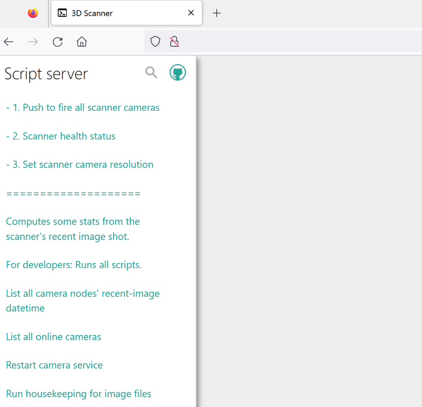

# End-user Manual

An end-user (or simply user) may access the scanner's user interface via http://CENTRALNODE/ui. The term CENTRALNODE is a placeholder for the hostname or an IP address. An end-user may also use a named URL, i.e. an URL containing a fix descriptive name, e.g. http://example.com/3dscanner, instead of the rather cryptic hostname or IP address. The developer creates the named URL when using the [dynamic DNS approach to access the scanner UI](dyndns.md).

## System Overview

The scanner is installed at the Reutlingen University and accessible for a user from within the university's network. A user may also dial into the university network via VPN. The following diagram is an abstract model of the 3DScanner from an end-user's perspective. It shall help to understand relevant terms. 

## User Interface Documentation

The user interface depicted in the image below displays two groups of functions divided by a separator. The functions most relevant for the end-user are found in the top group:

* **Push to fire all scanner cameras:** click and execute this function to fire all scanner cameras and download the images from http://CENTRALNODE/ (same URL as the user interface, but without the `/ui` at the end)
* **Scanner health status:** It checks the connection to the scanner and counts ready cameras nodes and other relevant status information. You may run this to check for your information before starting a series of taking images with the scanner.

Other functions in the group below the separator are primarily to monitor and maintain technical aspects of the scanner. Use with caution and only when asked to do so by developer. Later software revisions may hide these functions.

### Shoot Images

tbd.

### Scanner Health Status

tbd.

### Compute Image Statistics

Use this after the taking images with the scanner. See image count and delay between shutter button and image.

tbd.

### List all Online Cameras

Provides a list of camera nodes and their update time

tbd.

### Restart camera service

Restarts the camera service on each camera node. This is necessary to fully rebuild a camnode's connection after the centralnode had restarted. Usually the CENTRALNODE takes care, but there might be situation where you have to do it manually. See [troubleshooting](troubleshooting.md).

tbd.

