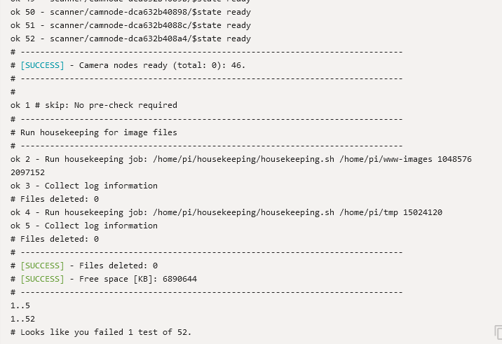

# End-user Manual

An end-user (or simply user) may access the scanner's user interface via http://CENTRALNODE/ui. The term CENTRALNODE is a placeholder for the hostname or an IP address. An end-user may also use a named URL, i.e. an URL containing a fix descriptive name, e.g. http://example.com/3dscanner, instead of the rather cryptic hostname or IP address. The developer creates the named URL when using the [dynamic DNS approach to access the scanner UI](dyndns.md).


## System Overview

The scanner is installed at the Reutlingen University and accessible for a user from within the university's network. A user may also dial into the university network via VPN. The following diagram is an abstract model of the 3DScanner from an end-user's perspective. It shall help to understand relevant terms. 

There are two types of nodes (computer science term for Raspberry Pi computers)

* CENTRALNODE: a Raspberry Pi computer providing the web-based UI and controlling all camera nodes for scanner operation. It also provides access to all images
* CAMNODE / camera node: many Raspberry Pi computers with cameras taking images of the object to be scanned and send them to the CENTRALNODE


## User Interface Documentation

The user interface depicted in the image below displays two groups of functions divided by a separator. The functions most relevant for the end-user are found in the top group:

* **Push to fire all scanner cameras:** click and execute this function to fire all scanner cameras and download the images from http://CENTRALNODE/ (same URL as the user interface, but without the `/ui` at the end)
* **Scanner health status:** It checks the connection to the scanner and counts ready cameras nodes and other relevant status information. You may run this to check for your information before starting a series of taking images with the scanner.

Other functions in the group below the separator are primarily to monitor and maintain technical aspects of the scanner. Use with caution and only when asked to do so by the developer. Later software revisions may hide these functions.


### Shot Images

When the end-user executes the `Push to fire all scanner cameras` function the scanner performs the following functions

1. preparing the cameras 
1. push the scanner's shutter button
1. Run housekeeping
1. Saving all camera images

The following screenshot shows the shutter button section from step 2. 


Only during this section a subject to be scanned has to stand still. It takes 2-3 seconds and includes everything from within this section. 

```
# ------------------------------------
# Push scanner's shutter button
# ------------------------------------

< ... the scanned subject has to stand still within this section ... >

# ------------------------------------
```

After all camera nodes have taken and stored their images, the CENTRALNODE starts downloading all images indicated in the `Saving all camera images` section (see screenshot below). The output in the screenshot displays regular checks waiting for completion.


Finally, the output displays the following success message about the number of images retrieved from the scanner's camera nodes.

```
[SUCCESS] - ... images available
```

### Scanner Health Status

The health status check performs various tests of the scanner components. The screenshot below displays a successful health status check. Please note the lines in the output starting with word `[SUCCESS]`.  



### Compute Image Statistics

Run this function after taking images with the scanner. You may review image count and delay between shutter button and image.

In the screenshot below one sees a successful run of the images statistics.


### List all Online Cameras

This function provides a list of camera nodes and their update time. The screenshot below shows a situation where all CAMNODEs are online. Please note the `[SUCCESS]` message.


### Restart camera service

Restarts the camera service on each camera node. This is necessary to fully rebuild a camnode's connection after the CENTRALNODE had restarted. Usually the CENTRALNODE takes care, but there might be situations where you have to do it manually. See [troubleshooting](troubleshooting.md).

The screenshot below displays a successful restart of the camera service on all CAMNODEs.


